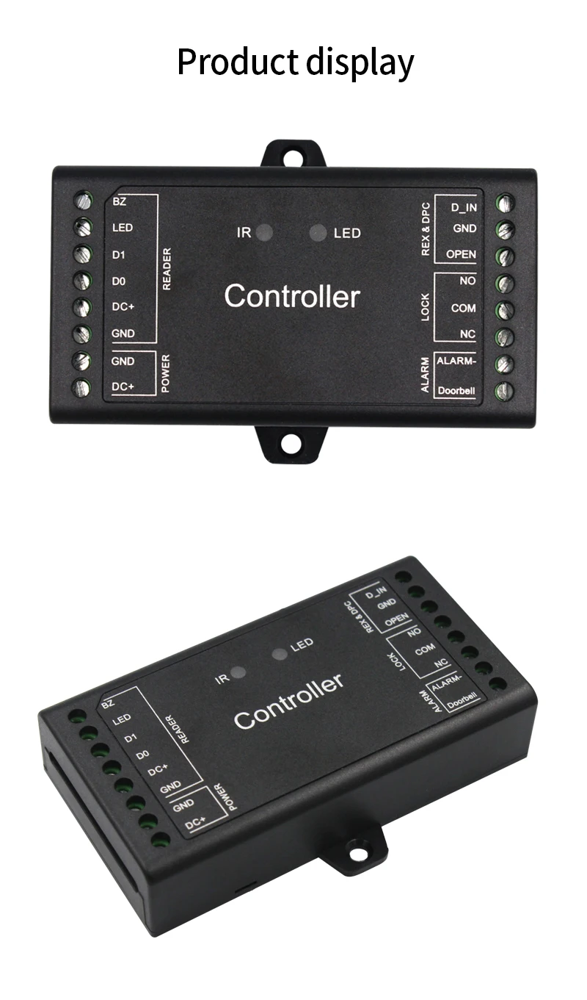
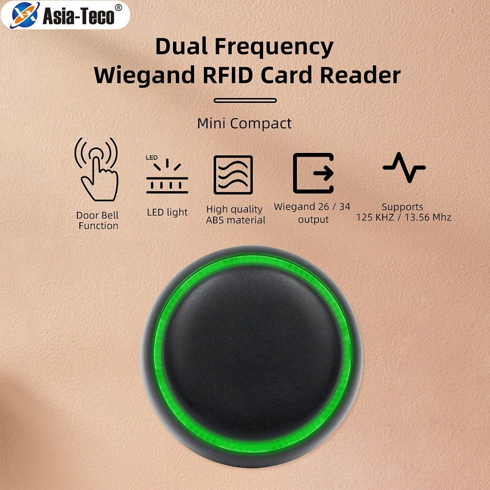

# ESPHome D1 Mini – RFID Контрол за Достъп

Проект за **контрол на достъп** с [ESPHome](https://esphome.io/) и **D1 mini**,  
поддържащ **двулентов RFID четец (125kHz + 13.56MHz)**, магнитен датчик за врата, и управление на електромагнитен насрещник (door strike).

## 📌 Основни функции

- Четене на RFID тагове (125 kHz и 13.56 MHz).
- Изпращане на всички сканирани тагове в **Home Assistant**.
- Разграничаване между:
  - **Разрешени тагове** – тези, които имат зададено име в Home Assistant → отключват вратата.
  - **Неразрешени тагове** – нови или без име → само се логват.
- Управление на електромагнитния насрещник чрез **door controller**.
- Засичане на състоянието на вратата (отворена/затворена) чрез магнитен сензор.

---

## ⚡ Хардуерни връзки (Wiring)

| Компонент                        | Пин на D1 mini | Бележка |
|----------------------------------|---------------|---------|
| **RFID Четец – DATA 0 (D0)**     | `D2` (GPIO4)  | Wiegand D0 линия |
| **RFID Четец – DATA 1 (D1)**     | `D1` (GPIO5)  | Wiegand D1 линия |
| **Door Controller – Trigger**    | `D6` (GPIO12) | Активиране на насрещника |
| **Magnetic Sensor Switch**       | `D5` (GPIO14) | Отчита отворена/затворена врата |
| **GND**                          | GND           | Обща маса |
| **VCC**                          | 5V или 3.3V   | В зависимост от устройството |

> ⚠ Уверете се, че RFID четецът и D1 mini имат **обща маса (GND)**.

---

## 🛠 Принцип на работа

1. **Сканиране на таг**  
   RFID четецът изпраща кода чрез Wiegand интерфейс към D1 mini.

2. **Обработка в ESPHome**  
   - Всички тагове се изпращат към Home Assistant.
   - Ако тагът има зададено **име** в Home Assistant → той е разрешен.
   - Ако тагът няма име → маркира се като нов/неразрешен.

3. **Отпушване на вратата**  
   - При разрешен таг → D1 mini активира изхода към **door controller**, който захранва електромагнитния насрещник.
   - Задава се време за отключване (например 3 секунди).

4. **Отчитане на състояние на вратата**  
   - Магнитният сензор изпраща в HA статус **Отворена** или **Затворена**.

---

## 🔌 Свързване

---

## 📂 ESPHome конфигурация

Примерният YAML файл (`d1mini.yaml`) се намира в това хранилище и включва:
- **external_components** за Wiegand RFID
- binary_sensor за магнитния сензор
- switch за управление на насрещника
- автоматизация за проверка на тагове чрез Home Assistant

---

## 📸 Схема

> 
> 

---

## 🏠 Интеграция с Home Assistant

1. Добавете устройството чрез ESPHome интеграцията.
2. В Home Assistant всички тагове ще се появят като `tag` събития.
3. В **Settings → Tags**:
   - Дайте име на разрешените тагове.
   - Използвайте автоматизации за отключване само при разпознат таг.

---

## 📜 Лиценз

Този проект е с отворен код и се разпространява под MIT лиценз.
